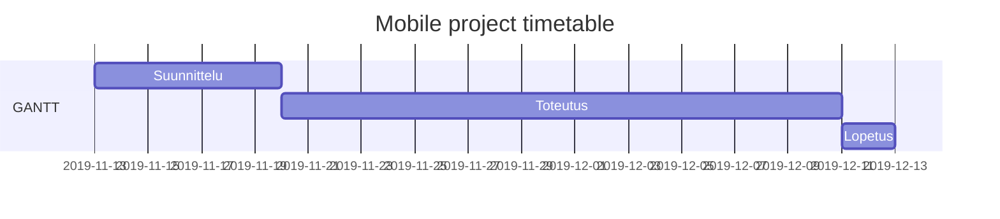

# Projektisuunnitelman sisältö

* Versio 0.4
* Päivitetty 11.12.2019

-----

[1. Projektin kuvaus](#1-projektin-ja-lopputuotteen-kuvaus)

Tausta ja lähtökohdat, Tavoitteet ja tehtävät, Termit

[2. Projektiorganisaatio](#2-projektiorganisaatio)

[3. Projektin ajalliset tavoitteet](#3-projektin-ajalliset-tavoitteet)

Resurssit, Aikataulut

[4. Projektin päättyminen](#4-projektin-p%C3%A4%C3%A4ttyminen)

Seminaari esitys, Projektin tuottaman aineiston arkistointi, Projektin virallinen päättäminen

-----

# 1 Projektin ja lopputuotteen kuvaus

## 1.1 Tausta ja lähtökohdat

Mobiiliprojekti toteutetaan Jyväskylän ammattikorkeakoulun IT-instituutin järjestämän TTOW0635 Mobile Project ‑opintojaksolla,
johon taustatutkimusta tehtiin TTOW0615 Mobile Application Development -opintojaksolla.
Projektin tarkoituksena on antaa valmiudet ja taidot suunnitella ja toteuttaa mobiilisovelluksia sekä antaa kokemusta projektityöskentelystä.

## 1.2 Tavoitteet ja tehtävät

Fireset-projektin tavoitteena on saada toimiva AR applikaatio demo, jossa yhdessä olevat ihmiset voivat pelata virtuaalisilla korteilla
korttipeliä.

## 1.3 Termit

AR = Artificial Reality

VR = Virtual Reality

# 2. Projektiorganisaatio

**Projektiryhmä**

Eetu Aaltonen

Leevi Kopakkala

Ilari Rajala

# 3. Projektin ajalliset tavoitteet

## 3.1 Resurssit

Kurssin tavoitteellinen tuntimäärä 135h/opiskelija ei tule lähtökohtaisestikkaan toteutumaan, muista kursseista johtuen,
mutta projektiin käytetään niin paljon aikaa, kun projektiryhmäläisillä siihen on.

## 3.2 Aikataulu

### Aloitus 13.11.2019 - 19.11.2019

Aloitetaan suunnittelemaan applikaation rakennetta tutkimuksen perusteella ja hahmottelemaan dokumentaatiota.

### Toteutus 20.11.2019 - 10.12.2019

Aloitetaan sovelluskehittäminen ja dokumentaation luonti.

#### Viikko 1

- Websocket alustus
- React-native alustus
- UI-suunnittelu
- Dokumentaatiota

#### Viikko 2

- Websocket game logic
- React-Nativen app logic
- Dokumentaatiota

#### Viikko 3

- Integrointi
- ViroReact game logic
- Testaus
- Dokumentaatiota
- Seminaarin valmistelu

### Lopetus 11.12.2019 -12.12.2019

Pidetään seminaari ja kerrotaan siellä kuinka hyvin pääsimme tavoitteeseemme.
Tämän jälkeen viimeistellään dokumentaatio sekä arvioidaan oma onnistuminen.

# 4. Projektin päättyminen

## 4.1 Seminaari

Projektin aikaansaannos esitellään seminaarissa opettajalle ja muille opiskelijoille.

## 4.2 Projektin tuottaman aineiston arkistointi

Projektin dokumentaatio jää GitLabiin.

## 4.3 Projektin virallinen päättäminen

Projekti päättyy, kun dokumentaatio on tehty ja luovutettu opettajalle, tuotos on esitetty seminaarissa ja opettaja hyväksyy suoritetun työn.

