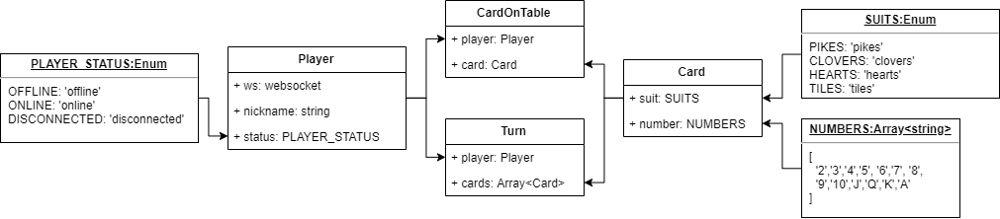
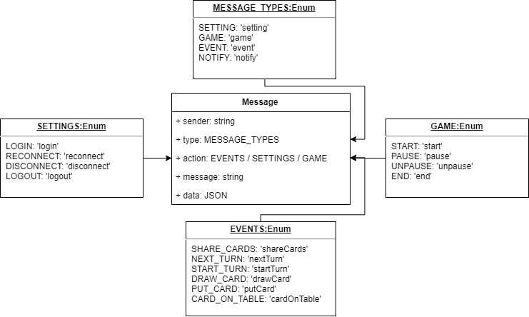
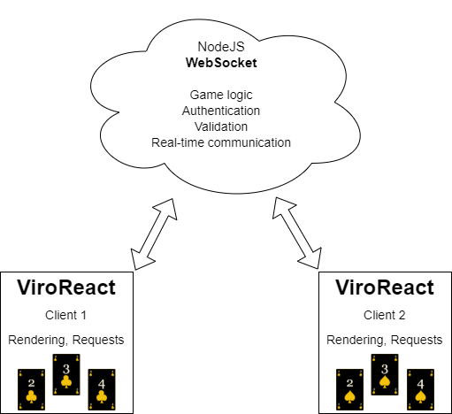
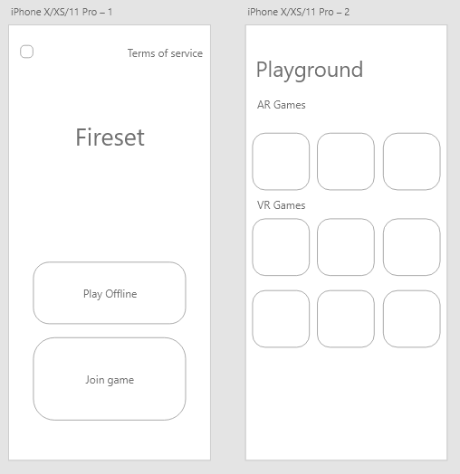

# TTOW0635 Mobile Project -kurssin projektin "Fireset" vaatimusmäärittely

* Versio 0.6
* Päivitetty 11.12.2019

------
[Johdanto](#johdanto)

[API rajapinta](#api-rajapinta)

[Luokka- ja yhteyskaavio](#luokka-ja-yhteyskaavio)

[Palvelun/ohjelmiston arkkitehtuuri](#palvelunohjelmiston-arkkitehtuuri)

[UI Mockup](#ui-mockup)

[Tärkeimmät käyttötapaukset](#tärkeimmät-käyttötapaukset)

[Tärkeimmät tunnistetut ominaisuudet](#tärkeimmät-tunnistetut-ominaisuudet)

[Vaatimukset](#vaatimukset)

------
# Johdanto

Mobile Project (TTOW0635) kurssin projekti "Fireset", joka on jatkoa Mobile Application Development (TTOW0615) kurssin tutkimustyölle.
Projektiin kuuluu sovelluksen suunnittelu ja dokumentointi, sovelluksen toteutus, testaus sekä loppuseminaari.

# API rajapinta

[API dokumentaatio](API.md)

# Luokka- ja yhteyskaavio

# Palvelun/ohjelmiston arkkitehtuuri 

# UI Mockup

# Tärkeimmät käyttötapaukset

| # | Käyttäjätyyppi | Käyttötapaus | Kuvaus |
|:-:|:-:|:-:|:-:|
| 1 | Pelaaja | KT-1 | Käyttäjä pystyy luomaan peli session, johon muut pelaajat voivat osallistua |
| 2 | Pelaaja | KT-2 | Käyttäjä pystyy valitsemaan pelin johon haluaa liittyä |
| 3 | Pelaaja | KT-3 | Käyttäjä pystyy liittymään valmiina olevaan peliin |
| 4 | Pelaaja | KT-4 | Käyttäjä pystyy lähtemään peli sessiosta pois |
| 5 | Pelaaja | KT-5 | Käyttäjät pystyvät pelaamaan peliä yhdessä |

# Tärkeimmät tunnistetut ominaisuudet

| Ominaisuus | Prioriteetti |
| :-: | :-: |
| FT1 | Peli session luonti | Tärkeä |
| FT2 | Peliin liittyminen | Tärkeä |
| FT3 | Pelin lopettaminen | Tärkeä |
| FT4 | Peli, jota voi pelata | Tärkeä |

# Vaatimukset
## Palveluun liittyvät tärkeimmät toiminnalliset vaatimukset

| VaatimusID | Tyyppi | Kuvaus | Ominaisuus johon vaikuttaa |								
|:-:|:-:|:-:|:-:|
| FUN-REQ-001 | Functional Requirement | Käyttäjän tulee pystyä liittymään valmiiksi luotuun peli sessioon | FT2 |
| FUN-REQ-002 | Functional Requirement | Peli ei saa loppua, jos pelaaja tippuu pelistä | FT4 |
| FUN-REQ-003 | Functional Requirement | Käyttäjän tulee pystyä lähtemään pelistä pois | FT3 |
| FUN-REQ-004 | Functional Requirement | Käyttäjän tulee pystyä luomaan peli sessio | FT1 |

## Palveluun liittyvät tärkeimmät ei-toiminnalliset vaatimukset
### Suorituskyky 

| VaatimusID | Tyyppi | Kuvaus | Ominaisuus johon vaikuttaa |								
|:-:|:-:|:-:|:-:|
| PER-REQ-001 | Non-Functional Performance | Käyttäjän suorittamasta toimenpiteestä ei saa mennä yli 2s, jos kyseessä pelaaminen tai yli 5s, jos kyse muusta toimenpiteen suorittamisesta, ellei lataus ikoni ole näkyvissä | |
| PER-REQ-002 | Non-Functional Performance | Pelin tulee pyöriä sulavasti lähes koko ajan (min 15fps) | FT4 |

### Käytettävyys

| VaatimusID | Tyyppi | Kuvaus |								
|:-:|:-:|:-:|
| USAB-REQ-001 | Non-Functional Usability | Käyttöliittymän kontrasti tulee olla tarpeeksi suuri |
| USAB-REQ-002 | Non-Functional Usability | Käyttöliittymän nappuloiden tulee olla tarpeeksi isot ja selvät |
| USAB-REQ-003 | Non-Functional Usability | Käyttöliittymän pitää skaalautua oikein eri mobiililaitteilla |

## Tuotteen järjestelmävaatimukset

| VaatimusID | Tyyppi | Kuvaus |								
|:-:|:-:|:-:|
| SYS-REQ-0001 | System Requirement | AR: ARKit (iOS) tai ARCore (Android) yhteensopiva laite |
| SYS-REQ-0002 | System Requirement | VR: Cardboard (iOS and Android), Daydream and Gear VR |
